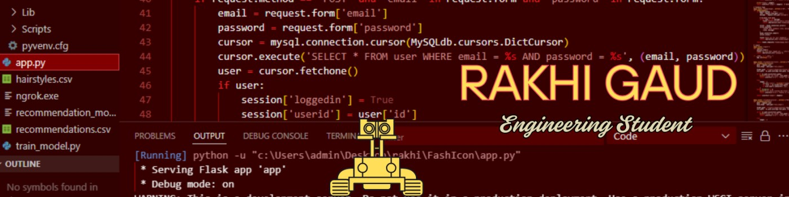

  

<h3 align="center">AI Engineer & Backend Developer — ML workflows, REST APIs, and full-stack cloud deployments</h3>

  

  
  
  

---

### 🧭 About Me

- 🎓 B.Tech in **Artificial Intelligence** (Minor: AR/VR) @ **Usha Mittal Institute of Technology, S.N.D.T Women's University** — CGPA 8.66/10
- 🤖 AI Engineer & Backend Developer — machine learning workflows, REST APIs, predictive modeling, and decentralized architectures
- 🏆 Top 100 team (out of 6,000+ nationwide) at **CIIA 2026**, and 5th Prize (₹10,000) at **Innovation Mahakumbh 2025**
- 🗳️ Currently researching **Votify** — a blockchain + AI electoral monitoring ecosystem
- 🌫️ Currently researching **DustVigil** — an IoT-based autonomous air pollution control pod
- 📢 Social Media, Creative & Capturer Head, NSS UMIT Council (2024–2026)
- 📫 rakhigaud1908@gmail.com

---

### 🛠️ Tech & Tools

  
  
  
  
  
  
  
  
  
  
  

---

### 🌀 Featured Projects

<table>
<tr>
<td width="50%" valign="top">

**🗳️ Votify** — Decentralized Electoral Monitoring Ecosystem
`Blockchain` `Iris Recognition` `Python`
Secure Python REST APIs for encrypted biometric authentication, a modular blockchain architecture with distributed ledgers for tamper-proof records, and a full-stack "Monitor Edition" dashboard for real-time anomaly tracking.

</td>
<td width="50%" valign="top">

**🌫️ DustVigil** — IoT Telemetry & Air Quality Pipeline
`Python` `MySQL` `IoT Sensors` `Flutter`
Autonomous air pollution control pod with multi-stage HEPA filtration and algae-based CO₂ sequestration. Scalable IoT data pipeline, MySQL window-function aggregations for pollution hot-spot mapping, and an interactive Flutter dashboard. IEEE-format research paper.

</td>
</tr>
<tr>
<td width="50%" valign="top">

**🐾 PawHeal** — AI-Based Pet Medical Diagnosis
`Flutter` `Python` `Flask` `Computer Vision`
Real-time, image-based animal injury classification via a Flask REST API, with a location-based framework to surface nearby medical resources and contextual first-aid recommendations.

</td>
<td width="50%" valign="top">

**👗 FashIcon** — ML-Powered Virtual Stylist
`Scikit-Learn` `Flask` `Vercel`
Personalized style recommendations (outfits, hairstyles, eyewear) from a Scikit-Learn classification pipeline, serialized with Joblib and deployed via a Flask backend on Vercel serverless.

</td>
</tr>
</table>

**📊 Air Pollution Data Analysis** — Relational database and complex SQL queries (filtering, aggregations, multi-table joins) mapping PM2.5/PM10 trends from real-time and historical CPCB data.

---

### 🏆 Achievements & Certifications

- 🥇 Top 100 teams (out of 6,000+ nationwide) — **CIIA 2026**
- 🏅 5th Prize (₹10,000) — **Innovation Mahakumbh 2025**, organized by SNDT Women's University
- 📜 AI Agents Intensive Certification (Kaggle & Google)
- 📜 AI Fundamentals (IBM SkillsBuild), Introduction to Generative AI (Google Cloud)

---

### 📊 GitHub Stats

  
  

  

---

<i>✦ Turning raw data pipelines into live, production-ready systems.</i>

